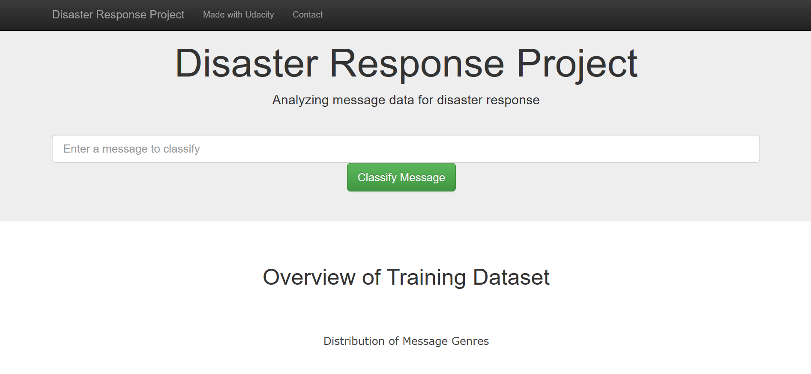
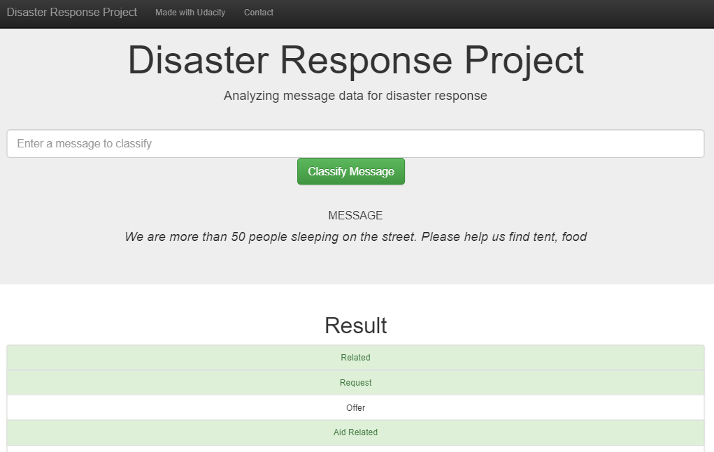
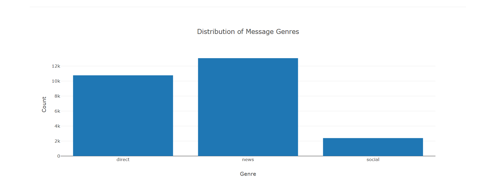
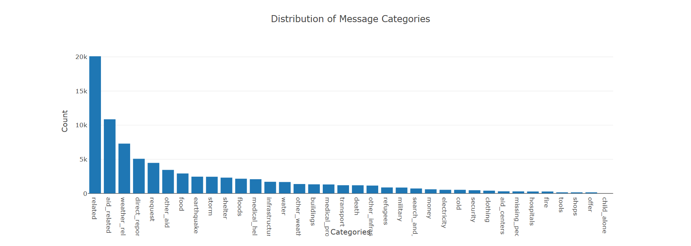

# Disaster Response Pipeline Project

## 1. Project Description
In this project, we will build a model to classify messages that are sent during disasters. 
There are 36 pre-defined categories, and examples of these categories include Aid Related, Medical Help, Search And Rescue, etc. By classifying these messages, we can allow these messages to be sent to the appropriate disaster relief agency. 
This project will involve the building of a basic ETL (Extract Transform & Load) and Machine Learning pipeline to facilitate the task. This is also a multi-label classification task, since a message can belong to one or more categories. 
 We will be working with a data set provided by [Figure Eight](https://www.figure-eight.com/) containing real messages that were sent during disaster events.

Finally, this project contains a web app where you can input a message and get the classification results.

## 2. Repository Structure
~~~~~~~
        Disaster_Response_Pipelines_Project
          |-- app
                |-- templates
                        |-- go.html # classification result page of web app
                        |-- master.html # main page of web app
                |-- run.py # Flask file that runs app
          |-- data
                |-- disaster_message.csv # data to process
                |-- disaster_categories.csv # data to process
                |-- DisasterResponse.db # database to save clean data to
                |-- process_data.py
          |-- models
                |-- classifier.pkl # saved model
                |-- train_classifier.py
          |-- Preparation # contains jupyter notebooks
                |-- categories.csv
                |-- ETL Pipeline Preparation.ipynb
                |-- ETL_Preparation.db
                |-- messages.csv
                |-- ML Pipeline Preparation.ipynb
                |-- README
          |-- README
~~~~~~~

## 3. Installation
The required libraries for running the code within Jupiter notebook & python files are part of the Anaconda distribution for Python 3.6.7. Following libraries were used:

* numpy
* pandas
* sqlalchemy
* re
* NLTK
* pickle
* sklearn
* plotly
* flask

## 4. Project Motivation
Sometimes when an area is hitted by a disaster like tsunami, earthquake, etc then there are lot of problems people facing during that time in that area like they need medical emergency, food, medicines, etc. 
So in this project, we will build a flask app based on machine learning to classify messages that are sent during disasters for help from people to government so that government agencies know what type of help at a particular area people need.

## 5. Files Description
1. **app** folder including the **templates** folder and `"run.py"` for the web application. "`run.py`" is main file to run the app.

2. **data** folder contains:
* "`disaster_messages.csv`" containing the messages which are sent during the disaster.
* "`disaster_categories.csv`" containing data about the categories of the disasters.
* "`DisasterResponse.db`" which is the database created after cleaning the data i.e. contains clean data.
* "`process_data.py`" contains the code in python file for data cleaning, transforming and save it into a new database called `DisasterResponse.db`.

3. **models** folder contains:
* "`classifier.pkl`" which is the model we build.
* "`train_classifier.py`" contains code in python file for training the Machine Learning model.

4. **Preparation** folder contains different jupyter notebook files which were used for the project building. (**`Please note:`** `this folder is not necessary for this project to run`.) 
Files are:
* `"categories.csv"` same file as "`disaster_categories.csv`".
* `"messages.csv"` same file as "`disaster_messages.csv`".
* `"ETL Pipeline Preparation.ipynb"` contains code for data cleaning & preparation in jupyter notebook.
* `"ETL_Preparation.db"` same as `"DisasterResponse.db"`.
* `"ML Pipeline Preparation.ipynb"` contains code for preparing ML Pipeline & model in jupyter notebook.

## 6. Instructions:
1. Run the following commands in the project's root directory to set up your database and model.

    - To run ETL pipeline that cleans data and stores in database  
        `python data/process_data.py data/disaster_messages.csv data/disaster_categories.csv data/DisasterResponse.db`
    - To run ML pipeline that trains classifier and saves  
        `python models/train_classifier.py data/DisasterResponse.db models/classifier.pkl`

2. Run the following command in the app's directory to run your web app.
    `python run.py`

3. Go to http://0.0.0.0:3001/

## 7. Some Snapshots

## 8. Acknowledgements

I would like to thank the mentors at Udacity for coaching necessary background skills in Data Analysis & Machine Learning.
